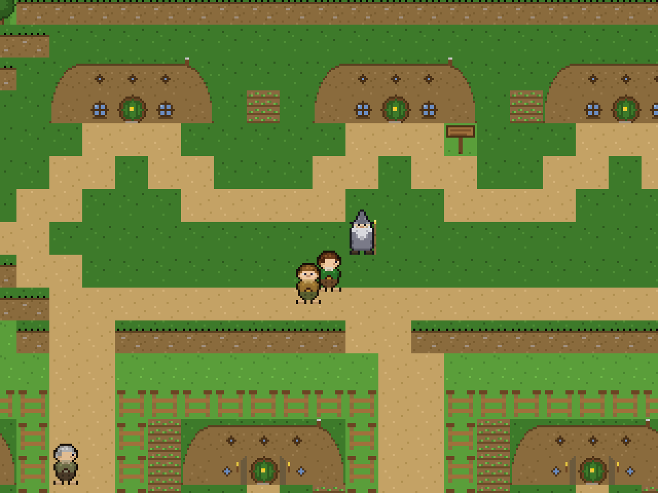
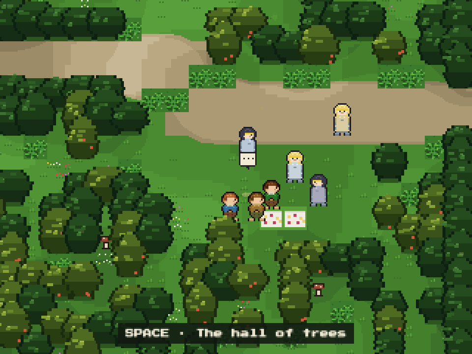
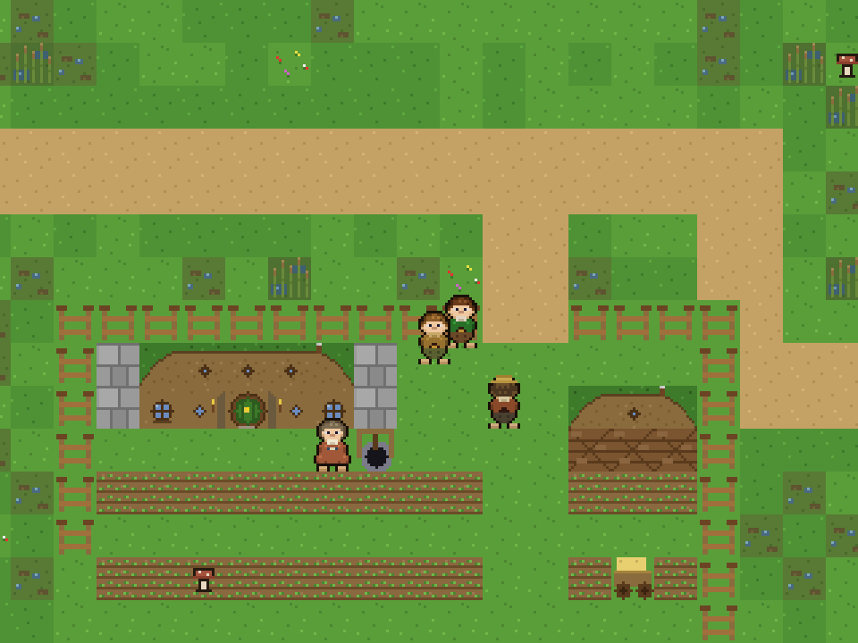
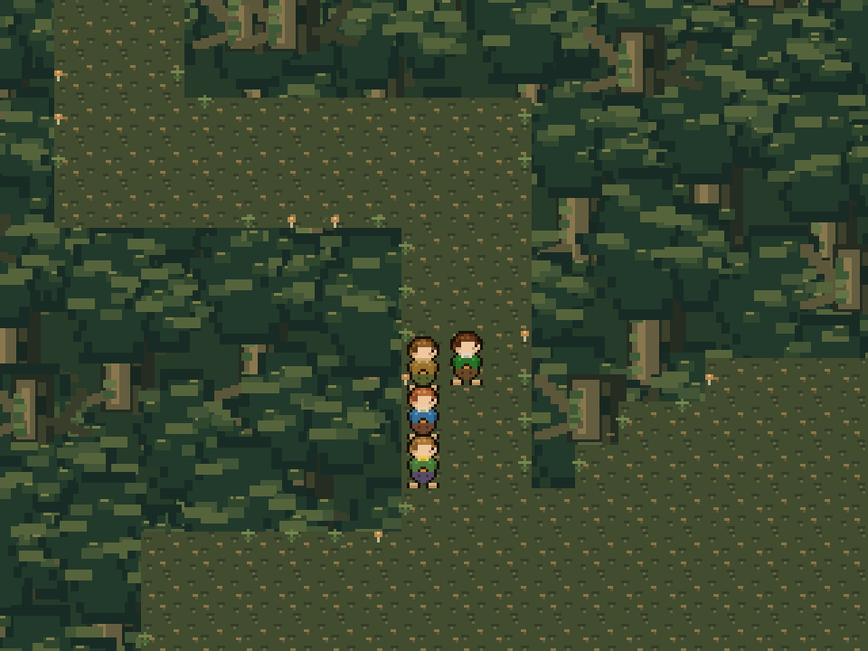
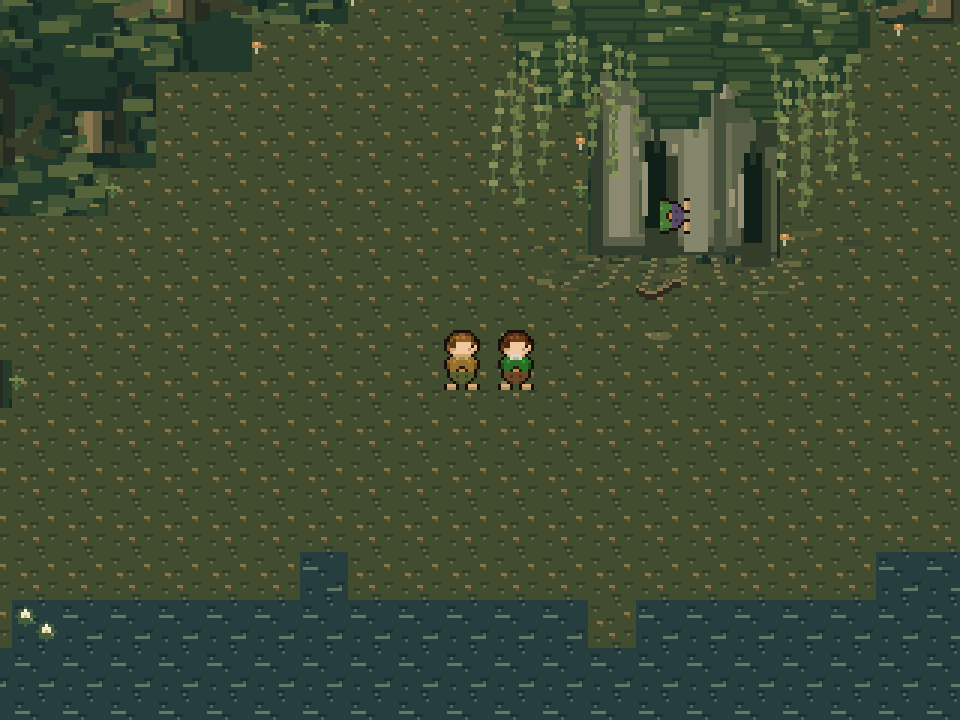
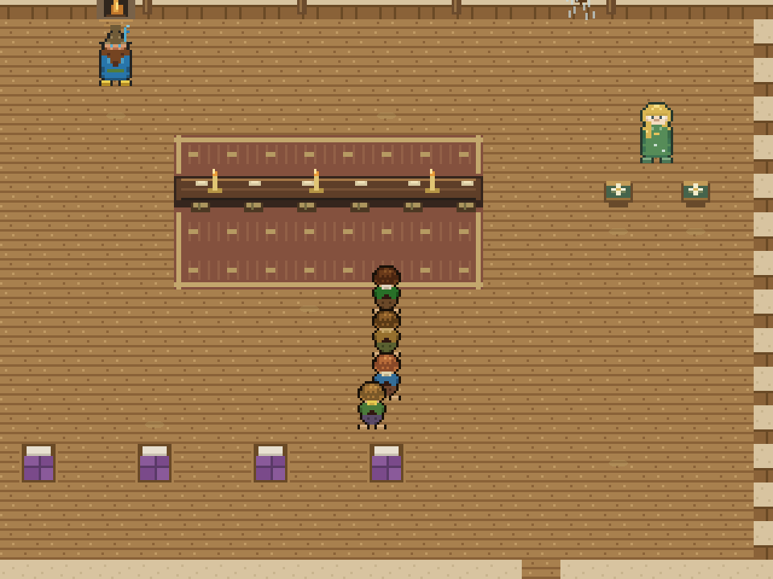
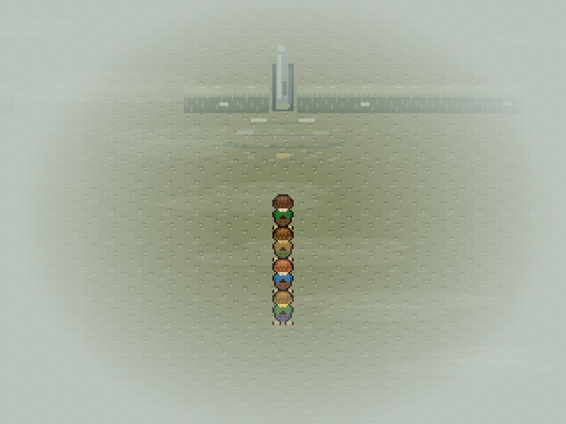
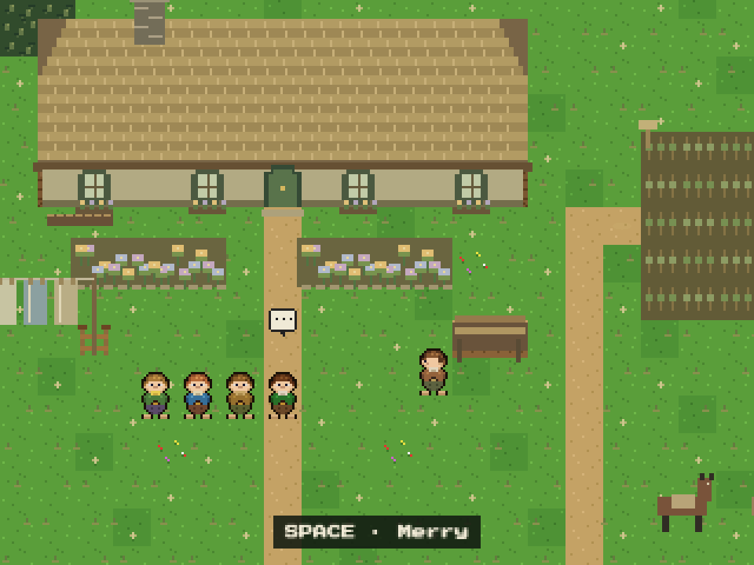
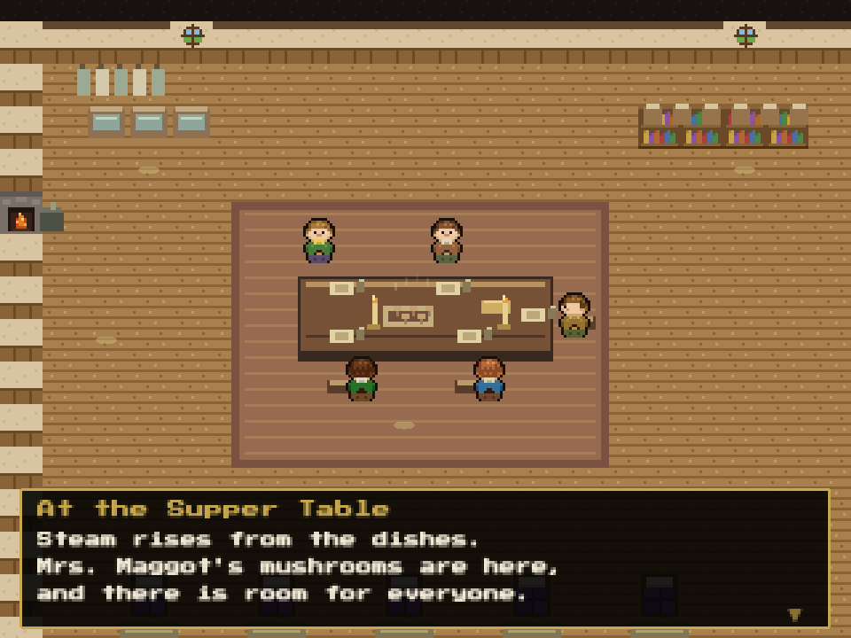

# The Lord of the Rings RPG

A top-down pixel art RPG covering _The Fellowship of the Ring_, faithful to Tolkien's books. Game Boy / Link's Awakening aesthetic — all art and audio generated procedurally in code, with no external assets.

Play as Frodo Baggins from the round green door of Bag End to the breaking of the Fellowship at Parth Galen.

**Play it in the browser: https://lotr.lonelymtnlabs.com**



|  |  |
| :----------------------------------------------------------------------------: | :-------------------------------------------------------------: |
|                   Gildor's company feasting in the Woody End                   |         Farmer Maggot's Bamfurlong, down in the Marish          |

|   |            |
| :-------------------------------------------------------------------------------: | :---------------------------------------------------------------------: |
|                                  The Old Forest                                   |                             Old Man Willow                              |
|  |  |
|                             Tom and Goldberry’s house                             |                            The Barrow-downs                             |

|  |  |
| :-----------------------------------------------------------------------------------: | :---------------------------------------------------------------------------: |
|                               The garden at Crickhollow                               |                        Supper and the friends' secret                         |

## Running Locally

```bash
npm install
npm run dev
```

Open the URL shown in your terminal.

| Key           | Action                     |
| ------------- | -------------------------- |
| Arrow keys    | Move                       |
| SPACE / ENTER | Talk / interact / advance  |
| I             | Inventory & errand overlay |
| Q             | Recall current objective   |
| M             | Mute audio                 |

## Status

**Chapters 1–3** are playable from Bilbo's farewell party to the East Road beyond the Barrow-downs. The published site updates when changes reach `main`.

Chapter 1 follows the Shire, the Black Rider, Gildor, Maggot, and the Brandywine ferry. Chapter 2 begins with an evening at Crickhollow: a secluded garden, hot baths, supper with all five hobbits, and the friends revealing their preparations. A night-to-morning cutscene brings the party back outside; Merry joins the travelling party, the tunnel opens beneath the High Hay, and the journey winds through the Bonfire Glade, a grassy knoll, misleading northern paths, deep hollows, and the Withywindle. Old Man Willow's capture and rescue use continuous character animation, moving tree cracks, and player actions to help Sam, extinguish the fire, and reach for the prisoners. Tom's rescue leads to two nights with Tom and Goldberry, including the rainy day and the Ring demonstration.

Chapter 3 crosses the open downs into fog, separation, and the barrow. Frodo defends his friends and calls Tom; the four blades and recovered ponies carry the party to the East Road. Bree is the next destination and is not yet playable. Twelve new zones bring the total to seventeen.

The new chapters use original paraphrased dialogue and procedural art/music. [Adaptation notes](docs/lore/old-forest-adaptation.md) distinguish book chronology from gameplay compression. Ponies appear at departure and rest stops; the four hobbits use the existing walking controls. Forest paths are deliberately winding and fixed, with optional places to inspect. Gold glints mark interactions; nearby prompts name the action.

Continue checkpoints preserve completed conversations, encounters, and both nights at the house, including older v1 saves. The `I` overlay pauses walking, and `Q` recalls the current objective.

On top of the main story sits an exploration layer: book-anchored side-errands (Lobelia's spoons, the Gaffer's half-pint, Gandalf's fireworks crates, Maggot's dogs) and two collectible tallies — mathoms and mushrooms — tracked in the `I`-key inventory overlay, with a soft nod from Merry for completionists who cross to Buckland with everything done.

The full game is planned as 10 chapters covering all of _Fellowship_. See `docs/PRD.md` for product requirements, `docs/game-reference.md` for the chapter breakdown, and `CHANGELOG.md` for release history.

## Development

```bash
npm run dev         # Vite dev server with HMR
npm run build       # production build → dist/
npm run preview     # preview the build
npm test            # Vitest unit suite
npm run test:watch  # unit tests in watch mode
npm run test:e2e    # Playwright smoke tests (boots the real game)
npm run lint        # ESLint
npm run typecheck   # tsc over the JSDoc data-layer contracts
npm run format      # Prettier (zone maps & pixel art are exempt)
```

- **Unit tests** (`tests/`) cover dialogue staging, zone map integrity (every door, exit, sign, and NPC cross-checked against what it references), the tile registry, the procedural art helpers, and the scripted set pieces (the Black Rider, the fox of the Woody End, Maggot's dogs).
- **Smoke tests** (`e2e/`) drive the actual game in a browser through the `window.__game` / `window.__state` QA hooks.
- **Art QA**: the dev server serves `art-test.html`, which renders the full tileset and every character spritesheet at high zoom.
- CI runs lint, typecheck, format check, unit tests, build, and e2e on pull requests and pushes to `main`.

## Tech

- [Phaser 3](https://phaser.io/) game engine
- [Vite](https://vite.dev/) build tool, [Vitest](https://vitest.dev/) + [Playwright](https://playwright.dev/) for tests
- All pixel art (tiles and character sprites) generated at runtime via Canvas 2D
- All music and SFX synthesized at runtime via WebAudio
- 320×240 gameplay view on a 960×720 canvas (3× camera zoom keeps the pixels chunky while text renders crisply), 16×16 tiles, scaled to fit the browser

## License

Code is [ISC licensed](LICENSE). This is an unofficial, non-commercial fan project, not affiliated with or endorsed by the Tolkien Estate or any rights holder of J.R.R. Tolkien's works.
