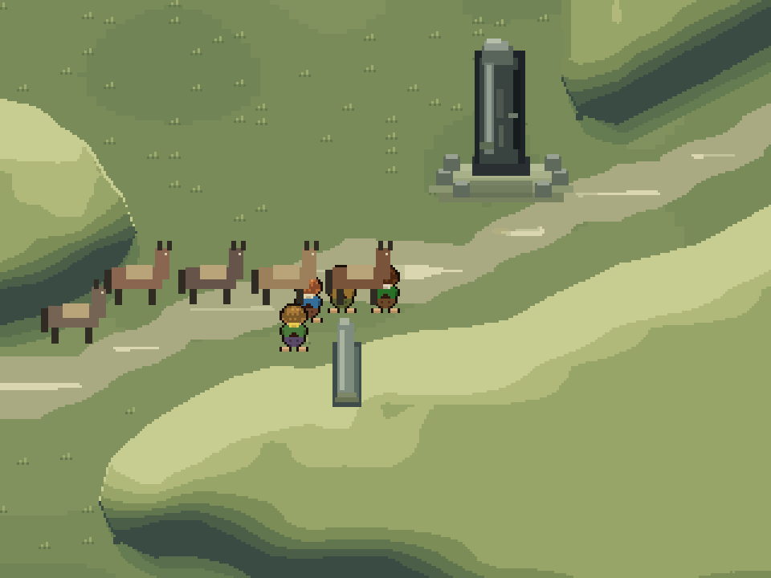
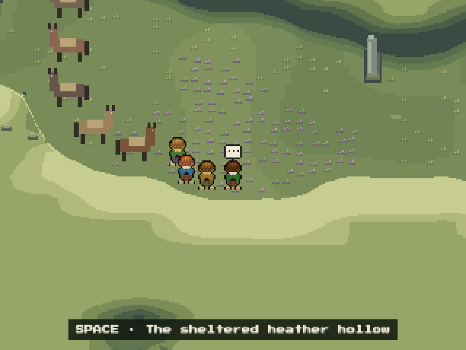

# PR 32 review and downs refinement

Reviewed [PR 32](https://github.com/enflory/lotr-rpg/pull/32) at `0b6198b` against `main`. The landscape and story changes match its stated scope. Improvements below are local changes on `feat/barrow-downs-polish`.

## Fixed findings

- **P1 — older Continue saves can remain black.** A save with `barrowCourage` but no newly introduced `barrowWoke` skipped the waking animation while keeping its opaque overlay. Later story milestones now imply waking has already happened.
- **P2 — older completed hill saves replay waking.** The arrival now respects the existing blades and recovered-ponies milestones.
- **P2 — collected blades remain visible.** Blade art now has a separate handle and follows its completion flag in the live scene.
- **P2 — recovered ponies appear only after reloading.** The hill now creates them when their dialogue completes, once.
- **P2 — companions cross solid gate stones.** Their procession now uses walkable routes through the gate instead of straight tweens through blockers.
- **P2 — eastern gate stone is drawn beside its collider.** Mirroring now includes rectangle widths, keeping the base on its own tile.

## Landscape and exploration

The airbrushed terrain has been replaced with broad, opaque color bands. The three terrain bakes each use 22 colors: warm crests, cool near faces, ground shadows, sparse grass tufts, clustered heather, and quiet chalk paths. There are no blended terrain fringes. Rounding still follows the collision mask, with a correction that preserves the solid/open meaning of every tile centre; this is not pixel-exact collision at curved edges.

Broken kerbstone arcs identify the southern burial mounds. A heather hollow and weathered-stone interaction give the existing southern loop two additional places to stop. Both are original environmental observations without new lore, rewards, or progression flags. A real-keyboard test walks the circuit and returns to the main track in daylight.

These are 960×720 captures of the running game, using QA positioning for the viewpoints. Traversal is verified separately by the browser tests.

## Verification

- 175 unit tests pass, including terrain palette/opacity, every hill and walkable tile centre, gate rooting, and route/data integrity.
- Lint, typecheck, formatting, production build, and diff whitespace checks pass.
- 10 relevant Playwright tests pass in 3.4 minutes: the full downs–barrow–East Road route with Continue reloads, daylight exploration, four story regressions, chapter seams, and pony movement.
- Browser inspection used gstack at 960×720. The production build retains the existing large-chunk advisory.

No unresolved actionable findings remain from this review. The full unrelated chapter 1/2 and touch suites were not rerun. Changes have not been committed or pushed.
